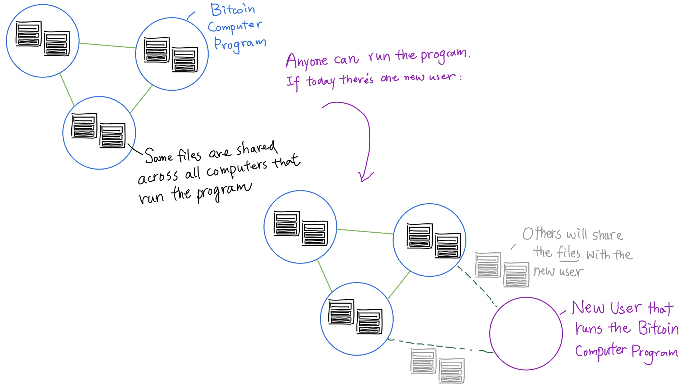
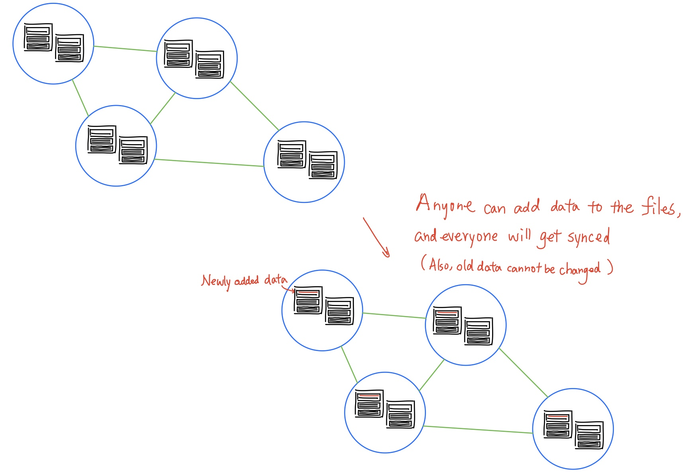
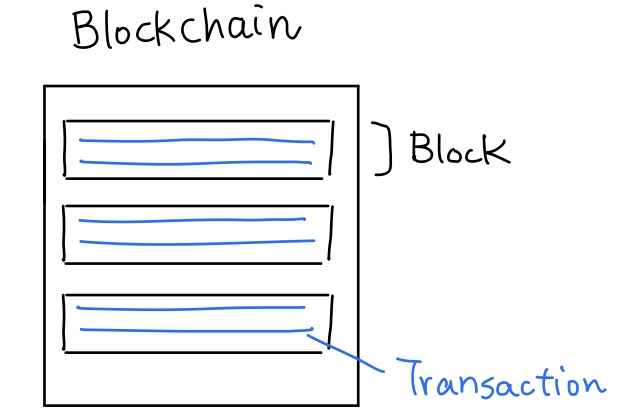
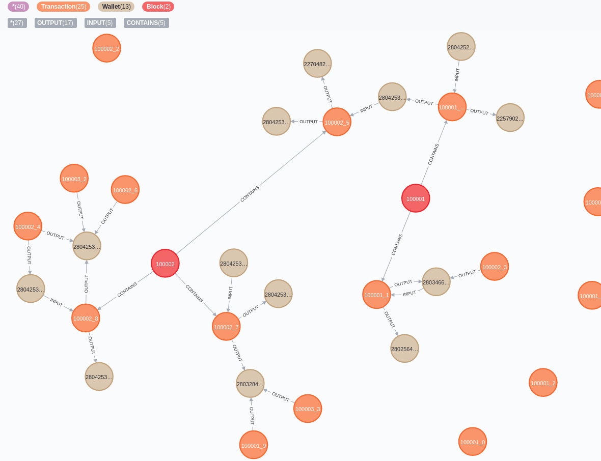
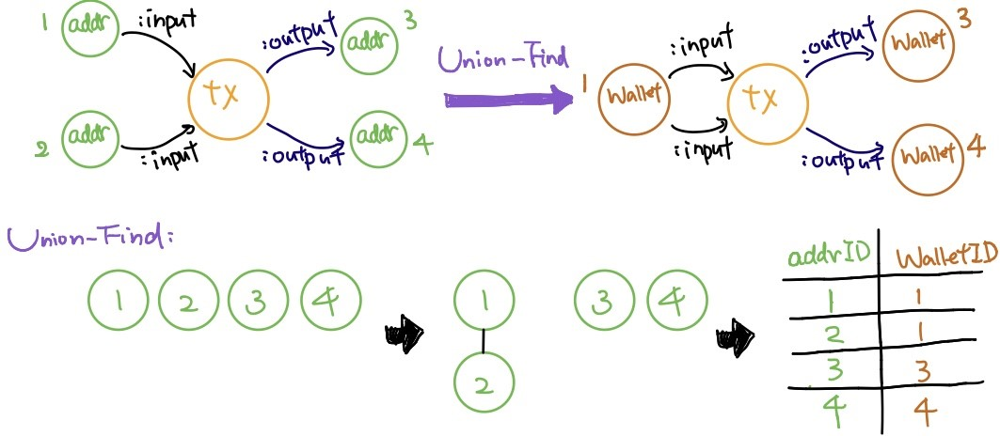
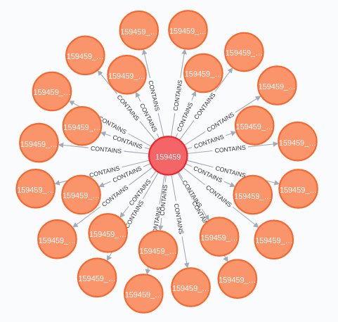
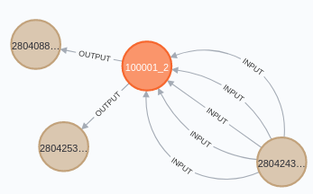
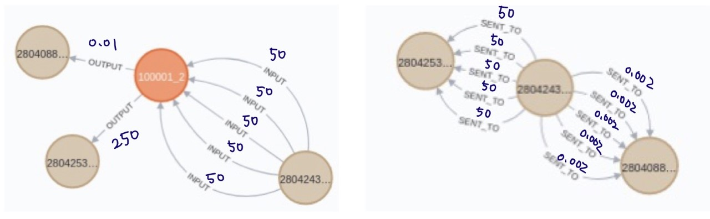
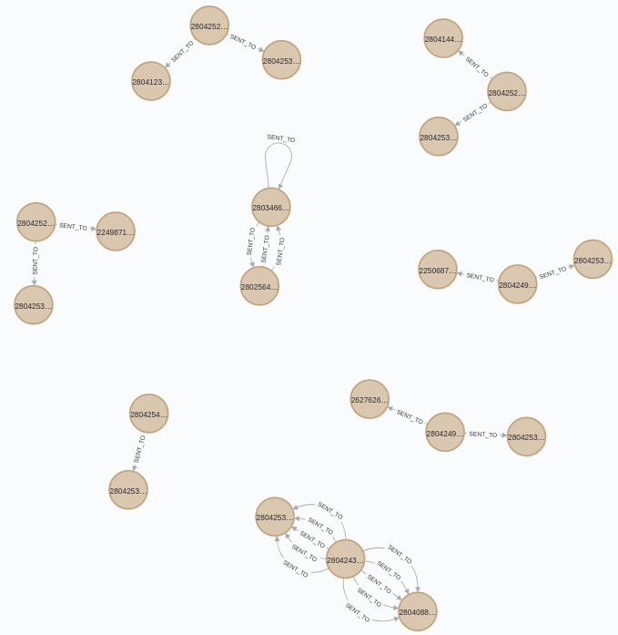

## Bitcoin introduction

{width="90%"}

## Bitcoin introduction

{width="70%"}

## Bitcoin introduction

- Files: blkxxx.dat
- Serialized data of blocks and transactions
- Block: version, previous block, time...
- Transaction: input/output addrs, value...

{width="35%"}

## Blockchain graph

{width="65%"}

## Blockchain graph (Nodes)

- Block: BlockID (height), timeStamp
- Transaction: TxID (height-txPosition, e.g. 10001-1), timeStamp, inputTotal, outputTotal
- Wallet (addrs aggregation): WalletID

{width="75%"}

## Blockchain graph (Relationships)

- Contains (Block-Transaction)
- Input/Output (Wallet-Transaction): value

{width="300"}

## Induced Transaction graph

- Node: Wallet
- Relationship: Sent_to {timeStamp, value}

## Induced Transaction graph

{width="55%"}

# Thank you
